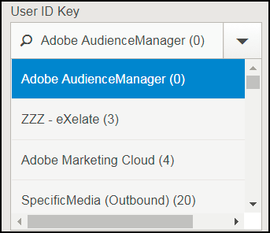
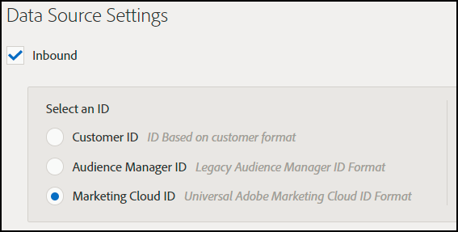

# Fehlerbehebung bei der Zieleinrichtung {#destination-setup-troubleshooting}

Informationen, die Ihnen beim Einrichten von Zielen in Audience Manager helfen und gängige Probleme vermeiden.

## Ich habe ein Ziel eingerichtet, aber ich sehe keine Dateien. Wo sind sie? {#destination-no-files}

<!-- c_dest_tshooting.xml -->

Zu den häufigen Problemen bei der Zielkonfiguration gehören die folgenden Probleme:

### Falsch konfiguriertes Ziel

* **Falscher [!UICONTROL UserID]-Schlüssel:** Der [!UICONTROL UserID]-Schlüssel ist die [!UICONTROL MasterDPID] dieses Ziels und die Grundlage für die ausgehenden ID-Werte. Selbst wenn ein [!UICONTROL UserID] über die Dropdown-Liste ausgewählt werden kann, bedeutet dies nicht unbedingt, dass diesem Wert IDs/Eigenschaften/Segmente zugeordnet sind. Wenn der [!UICONTROL Outbound]-Prozess (der ausgeführt wird, nachdem Ziele erstellt wurden) keine Benutzer findet, die diesem [!UICONTROL UserID] zugeordnet sind, werden keine Daten ausgegeben.
* **Nein In Datei - Datenquellen ausgewählt:** Bei der Auswahl eines anderen Zieltyps als [!UICONTROL S2S] wird unten im Bildschirm ein Abschnitt mit der Bezeichnung [!UICONTROL Configure Data Sources] angezeigt. Wenn dieser Abschnitt zum ersten Mal angezeigt wird, werden keine Werte ausgewählt. Wenn Sie das Kontrollkästchen [!UICONTROL All First Party] vergessen haben oder Datenquellen einzeln im [!UICONTROL Available Data Sources] auswählen, werden keine Daten ausgegeben.

### Falsch konfiguriertes Format

Bei der Auswahl eines Formats für Ihre ausgehenden Daten ist es am besten, wenn möglich, ein vorhandenes Format wiederzuverwenden. Die Verwendung eines bereits bewährten Formats stellt sicher, dass Ihre ausgehenden Daten erfolgreich generiert werden. Um genau zu sehen, wie ein vorhandenes Format formatiert ist, klicken Sie auf die Option [!UICONTROL Formats] in der Menüleiste und suchen Sie entweder nach Name oder nach ID-Nummer nach Ihrem Format. Falsch formatierte Formate oder Makros, die in -Formaten verwendet werden, liefern eine falsch formatierte Ausgabe oder verhindern die Ausgabe von Informationen vollständig.

Weitere Informationen zum Einrichten von Formaten und Verwenden von Makros finden Sie unter [Dateiformatmakros](formats/file-formats.md#) und [HTTP-Formatmakros](formats/web-formats.md).

### Falsch konfigurierter Server

* **[!DNL FTP]**
   * **[!UICONTROL Domain]**
      * Geben Sie keine Präfixe für Hostnamen ein. Wenn Sie eine [!DNL ftp://hello.com] erhalten haben, geben Sie einfach [!DNL hello.com] in dieses Feld ein.
   * **[!UICONTROL Port/Type Combination]**
      * Bei einer [!DNL FTP] ist der bevorzugte Übertragungstyp [!DNL SFTP].
      * Bei der Auswahl des [!DNL SFTP] ist der Port fast immer 22.
      * Bei der Auswahl des [!DNL FTPs/TLS] ist der Port fast immer 21.
      * Der [!DNL FTPs/TLS] ist nicht dasselbe wie eine normale [!DNL FTP]. Wir unterstützen keine regelmäßigen (ungesicherten) [!DNL FTP].
   * **[!UICONTROL Remote Path]**
      * Bei der Auswahl eines Remote-Unterpfads sollte dieser ohne Schrägstrich eingegeben werden.
      * Wenn die übertragene Datei im [!DNL (root)/inbound] Unterordner abgelegt werden soll, fügen Sie einfach [!DNL inbound] für den Remote-Pfad hinzu, nicht [!DNL /inbound].
      * Wenn Sie Ihre Dateien in mehreren Verzeichnissen senden, geben Sie zwischen den einzelnen Verzeichnissen Schrägstriche ein. Wenn Sie den Speicherort von [!DNL /inbound/subdirectory1/subdirectory2] angegeben haben, sollten Sie [!DNL inbound/subdirectory1/subdirectory2] in dieses Feld eingeben.
      * Wenn Ihre Datei in dem Verzeichnis platziert werden soll, zu dem der externe Server automatisch weiterleitet, können Sie dieses Feld leer lassen. Geben Sie keinen Punkt ein ( . ), Schrägstrich ( / ) oder etwas Anderes.

* **[!DNL S3]**
   * [!DNL S3] ist das bevorzugte Übertragungsprotokoll (über [!DNL FTP] oder [!DNL HTTP]).
      * **[!UICONTROL Bucket]**
         * Der Behältername sollte ohne Schrägstriche, Präfixe, Suffixe usw. aufgeführt werden. Wenn Sie die Adresse erhalten haben, [!DNL s3://your-bucket] Sie einfach [!DNL your-bucket] zu diesem Feld hinzufügen.
      * **[!UICONTROL Directory]**
         * Lassen Sie dieses Feld leer, es sei denn, Sie haben ein Unterverzeichnis angegeben, in dem die Daten abgelegt werden sollen. Wenn Sie die [!DNL s3://your-bucket/your-subdirectory] erhalten haben, geben Sie [!DNL your-bucket] in das Feld [!UICONTROL Bucket] ein und [!DNL your-subdirectory] sollten in das Feld [!UICONTROL Directory] eingefügt werden. Fügen Sie keine vorangehenden Schrägstriche hinzu.
         * Wenn Sie mehrere Ordner entlang des Pfads verschieben müssen, sollten Sie nur Schrägstriche als Trennzeichen verwenden. Ein Speicherort von [!DNL s3://your-bucket/your-subdirectory1/your-subdirectory2] wäre also im Feld [!UICONTROL Bucket] [!DNL your-bucket] und [!DNL your-subdirectory1/your-subdirectory2] in das Feld [!UICONTROL Directory] eingegeben worden.
      * **[!UICONTROL Access / Secret Keys]**
         * Wenn [!DNL TechOps] einen Bucket erstellt und einem Berater Zugriffs-/Geheimschlüssel bereitstellt, sind diese Anmeldeinformationen in der Regel `READ-ONLY` Anmeldeinformationen, die an den Client übergeben werden sollen. Diese Anmeldeinformationen sollten nicht in die [!UICONTROL Access / Secret Key] Felder eingegeben werden, da dies dazu führt, dass die Übertragung fehlschlägt (da diese Anmeldeinformationen schreibgeschützt und nicht schreibbar sind). Wenn [!DNL TechOps] einen Bucket erstellt und Anmeldeinformationen bereitstellt, sollte der Berater auch ein Adobe-Schlüsselpaar anfordern (NICHT AN DEN CLIENT ZU GEBEN), das das Schreiben von Dateien in diesen Bucket ermöglicht. Dieser Schlüssel sollte diesen Feldern hinzugefügt werden.

* **[!DNL HTTP]**
   * **[!UICONTROL Domain]**
      * Geben Sie keine Präfixinformationen für [!DNL HTTP] Einträge ein. Wenn Sie eine [!DNL https://superduper.com] erhalten haben, geben Sie [!DNL https://superduper.com] in dieses Feld ein.
      * **[!UICONTROL URL Prefix]**
         * Lassen Sie beim Hinzufügen eines [!DNL URL]-Präfixes den vorangehenden Schrägstrich deaktiviert. Die Adresse [!DNL https://hello.com/r/x/y/z] sollte in das Feld [!UICONTROL Domain] eingegeben [!DNL https://hello.com] und hier in das Feld [!UICONTROL URL Prefix] eingegeben [!DNL r/x/y/z].
         * Wenn kein [!UICONTROL URL Prefix] benötigt wird, lassen Sie dieses Feld leer.
      * **[!UICONTROL Authentication - SSH Key]**
         * Geben Sie in dieses Feld den vollständigen Wert des `SSH PRIVATE`-Schlüssels ein, einschließlich Kopf- und Fußzeilen sowie Zeilenumbrüchen, um eine genaue Verschlüsselung/Schlüsselspeicherung sicherzustellen.

### Nicht genügend Zeit für die ausgehende Generierung

Der ausgehende Prozess wird zweimal täglich ausgeführt und umfasst mehrere Prozesse (ausgehende, veröffentlichende, an externe Standorte pushen usw.) Muss ausgeführt werden, bevor eine Datei an ihr endgültiges Ziel gepusht wird. Eine gute Faustregel ist, dass ein Ziel mindestens 24 Stunden vor dem vermutlich an einen externen Speicherort gepushten Daten vollständig konfiguriert sein sollte.

### Datei-Split-Größen zu groß

Beim Ausgeben von Dateien an Ziele können Sie größere ausgehende Dateien in Datei-Chunks aufteilen. Stellen Sie sicher, dass die einzelnen Dateiblöcke 10 GB nicht überschreiten. Siehe auch [Name der ausgehenden Datendatei: Syntax und Beispiele](https://experienceleague.adobe.com/docs/audience-manager/user-guide/implementation-integration-guides/receiving-audience-data/batch-outbound-data-transfers/outbound-file-name-contents.html?lang=de).

## Einrichten Ihrer Ziele zum Exportieren von Experience Cloud-IDs, Kunden-IDs oder Audience Manager-IDs in ausgehende Datendateien {#set-up-destinations-export}

Auf dieser Seite erfahren Sie, wie Sie Ziele einrichten, um Daten zu exportieren, die von dem in [!UICONTROL Outbound Data Files] gewünschten ID-Typ codiert wurden.

<!-- set-up-destinations-mcid-aamid.xml -->

Ziele ermöglichen es unseren Kunden, ihre Daten über eine beliebige Anzahl digitaler Kanäle zu aktivieren. Beispielsweise können sie Zielgruppendaten in andere [!DNL Adobe Experience Cloud]-Lösungen ([!DNL Target], [!DNL Campaign] usw.) exportieren. Oder sie können Daten an [!UICONTROL DSP]s, [!UICONTROL SSP] oder jede andere Plattform senden, die in Audience Manager integriert ist. Wir führen eine Liste der Partner, mit denen wir zusammenarbeiten, auf unserer Seite [Integrations Wiki](https://wiki.corp.adobe.com/display/MCPI).

>[!NOTE]
>
>Eine ausführliche Anleitung zum Erstellen von Zielen in der Admin-Benutzeroberfläche finden Sie im Artikel [Erstellen oder Bearbeiten von Unternehmenszielen](companies/admin-manage-company-destinations.md#create-edit-company-destinations) .

Ihre Kunden möchten je nach Ziel verschiedene ID-Typen exportieren. Das folgende Konfigurationsdiagramm zeigt die Optionen, die Sie zum Exportieren von Profilinformationen zu verschiedenen ID-Typen auswählen sollten. Es wird empfohlen, auch auf den [ID-Index in Audience Manager&quot; &#x200B;](https://experienceleague.adobe.com/docs/audience-manager/user-guide/reference/ids-in-aam.html?lang=de). Es gibt drei wichtige Einstellungen, die zu berücksichtigen sind: die [!UICONTROL User ID Key], die [!UICONTROL Data Source Type] und die [!UICONTROL Format]. Im Folgenden werden alle beschrieben.

* [!UICONTROL User ID Key]. Gehen Sie im [!UICONTROL Admin UI] zu **[!UICONTROL Companies]**. Suchen Sie nach dem Unternehmen Ihres Kunden und klicken Sie darauf. Suchen Sie nach der Registerkarte **[!UICONTROL Destinations]** und drücken Sie **[!UICONTROL Add Destination]**. Wählen Sie im **[!UICONTROL Add Destination]**-Workflow die [!UICONTROL User ID Key] aus. Die [!UICONTROL User ID Key] filtert die eingehenden IDs aus der Zieldatenquelle und lässt nur die IDs zu.

  

* [!UICONTROL Data Source Type]. Wählen Sie diese Option, wenn Sie in der Audience Manager-Benutzeroberfläche ein Ziel erstellen. Wählen Sie zunächst [!UICONTROL Inbound] und dann den gewünschten ID-Typ aus. Die Optionen sind:

  

* [!UICONTROL Format]. Diese Option bestimmt das Dateiformat, das exportiert werden soll. Wählen Sie im **[!UICONTROL Add Destination]**-Workflow unter **[!UICONTROL Batch Data]** das Format aus.

Um ein Format zu überprüfen, gehen Sie zu **[!UICONTROL Admin UI > Formats]** und suchen Sie nach dem [!UICONTROL Data Row]. Dieses Element enthält ein Makro im Dateiformat &lt;MCID> im folgenden Beispiel.

<table id="table_DAEE5BC75DCB4FC690C4BAE41F627DEC"> 
 <thead> 
  <tr> 
   <th colname="col01" class="entry"> Konfigurationsnr. </th> 
   <th colname="col1" class="entry"> 
Benutzerschlüssel 
 </th> 
   <th colname="col2" class="entry"> 
Source-Datentyp 
 </th> 
   <th colname="col3" class="entry"> 
Format 
 </th> 
   <th colname="col4" class="entry"> 
Exportierter ID-Typ 
 </th> 
  </tr>
 </thead>
 <tbody> 
  <tr> 
   <td colname="col01"> 1 </td> 
   <td colname="col1"> 
Adobe Audience Manager (0) 
 </td> 
   <td colname="col2"> 
Experience Cloud ID 
 </td> 
   <td colname="col3"> 
&lt;DP_UUID&gt; 
 </td> 
   <td colname="col4"> 
Experience Cloud ID 
 </td> 
  </tr> 
  <tr> 
   <td colname="col01"> 2 </td> 
   <td colname="col1"> 
Adobe Audience Manager (0) 
 </td> 
   <td colname="col2"> 
Experience Cloud ID 
 </td> 
   <td colname="col3"> 
MCID 
 </td> 
   <td colname="col4"> 
AUDIENCE MANAGER UUID 
 </td> 
  </tr> 
  <tr> 
   <td colname="col01"> 3 </td> 
   <td colname="col1"> 
Adobe Audience Manager (0) 
 </td> 
   <td colname="col2"> 
Experience Cloud ID 
 </td> 
   <td colname="col3"> 
UUID 
 </td> 
   <td colname="col4"> 
Experience Cloud ID 
 </td> 
  </tr> 
  <tr> 
   <td colname="col01"> 4 </td> 
   <td colname="col1"> 
Adobe Audience Manager (0) 
 </td> 
   <td colname="col2"> 
AUDIENCE MANAGER ID 
 </td> 
   <td colname="col3"> 
&lt;DP_UUID&gt; 
 </td> 
   <td colname="col4"> 
AUDIENCE MANAGER UUID 
 </td> 
  </tr> 
  <tr> 
   <td colname="col01"> 5 </td> 
   <td colname="col1"> 
Adobe Audience Manager (0) 
 </td> 
   <td colname="col2"> 
AUDIENCE MANAGER ID 
 </td> 
   <td colname="col3"> 
MCID 
 </td> 
   <td colname="col4"> 
Experience Cloud ID 
 </td> 
  </tr> 
  <tr> 
   <td colname="col01"> 6 </td> 
   <td colname="col1"> 
Adobe Audience Manager (0) 
 </td> 
   <td colname="col2"> 
AUDIENCE MANAGER ID 
 </td> 
   <td colname="col3"> 
UUID 
 </td> 
   <td colname="col4"> 
AUDIENCE MANAGER UUID 
 </td> 
  </tr> 
  <tr> 
   <td colname="col01"> 7 </td> 
   <td colname="col1"> 
DPID (Jede Datenquelle, auf die das Unternehmen Zugriff hat) 
 </td> 
   <td colname="col2"> 
Kunden-ID 
 </td> 
   <td colname="col3"> 
&lt;DP_UUID&gt; 
 </td> 
   <td colname="col4"> 
Kunden-ID (DPUUID) 
 </td> 
  </tr> 
  <tr> 
   <td colname="col01"> 8 </td> 
   <td colname="col1"> 
DPID (Jede Datenquelle, auf die das Unternehmen Zugriff hat) 
 </td> 
   <td colname="col2"> 
Kunden-ID 
 </td> 
   <td colname="col3"> 
MCID 
 </td> 
   <td colname="col4"> 
Experience Cloud ID 
 </td> 
  </tr> 
  <tr> 
   <td colname="col01"> 9 </td> 
   <td colname="col1"> 
DPID (Jede Datenquelle, auf die das Unternehmen Zugriff hat) 
 </td> 
   <td colname="col2"> 
Kunden-ID 
 </td> 
   <td colname="col3"> 
UUID 
 </td> 
   <td colname="col4"> 
AUDIENCE MANAGER UUID 
 </td> 
  </tr> 
  <tr> 
   <td colname="col01"> 10 </td> 
   <td colname="col1"> 
DPID (Jede Datenquelle, auf die das Unternehmen Zugriff hat) 
 </td> 
   <td colname="col2"> 
AUDIENCE MANAGER ID 
 </td> 
   <td colname="col3"> 
&lt;DP_UUID&gt; 
 </td> 
   <td colname="col4"> 
AUDIENCE MANAGER UUID 
 </td> 
  </tr> 
  <tr> 
   <td colname="col01"> 11 </td> 
   <td colname="col1"> 
DPID (Jede Datenquelle, auf die das Unternehmen Zugriff hat) 
 </td> 
   <td colname="col2"> 
AUDIENCE MANAGER ID 
 </td> 
   <td colname="col3"> 
MCID 
 </td> 
   <td colname="col4"> 
Experience Cloud ID 
 </td> 
  </tr> 
  <tr> 
   <td colname="col01"> 12 </td> 
   <td colname="col1"> 
DPID (Jede Datenquelle, auf die das Unternehmen Zugriff hat) 
 </td> 
   <td colname="col2"> 
AUDIENCE MANAGER ID 
 </td> 
   <td colname="col3"> 
UUID 
 </td> 
   <td colname="col4"> 
AUDIENCE MANAGER UUID 
 </td> 
  </tr> 
 </tbody> 
</table>

## Nutzungsszenarios

Nehmen wir an, Sie verwenden Audience Manager und [!DNL Campaign]. Um die Kundendaten in [!DNL Campaign] verwertbar zu machen, sollten Sie [!UICONTROL Experience Cloud IDs] exportieren. In diesem Fall sollten Sie die Konfiguration Nr. 3 verwenden.
