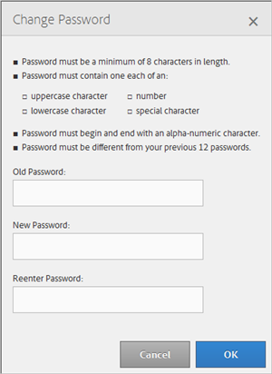

# Mein Profil {#my-profile}

Bearbeiten Sie die Details Ihres Audience Manager Admin-Tool-Profils oder ändern Sie Ihr Kennwort.

<!-- c_my_profile.xml -->

## Profil bearbeiten {#edit-profile}

Zeigen Sie Ihr Audience Manager Admin-Tool-Profil an und bearbeiten Sie es, einschließlich Vor- und Nachname, Benutzername, E-Mail-Adresse, Telefonnummer, [!UICONTROL IMS ID], Benutzerrollen und Status.

<!-- t_edit_profile.xml -->

1. Klicken Sie auf **[!UICONTROL My Profile]**.

   

2. Füllen Sie die Felder aus:
   * **[!UICONTROL First Name]:** (Erforderlich) Geben Sie Ihren Vornamen an.
   * **[!UICONTROL Last Name]:** (Erforderlich) Geben Sie Ihren Nachnamen an.
   * **[!UICONTROL Username]:** (Erforderlich) Geben Sie Ihren ersten Benutzernamen an.
   * **[!UICONTROL Email Address]:** (Erforderlich) Geben Sie Ihre E-Mail-Adresse an.
   * **[!UICONTROL Phone Number]:** Geben Sie Ihre Telefonnummer an.
   * **[!UICONTROL IMS ID]:** Geben Sie Ihre Internet-Messaging-Service-ID an.
   * **[!UICONTROL User Roles]:** Wählen Sie die gewünschten Benutzerrollen aus:
      * **[!UICONTROL DEXADMIN]:** Ermöglicht Admins die Durchführung von Aufgaben im Audience Manager Admin-Tool. Wenn Sie diese Option nicht auswählen, können Sie einzelne Rollen auswählen. Diese Rollen ermöglichen es Benutzenden, Aufgaben mithilfe von [!DNL API]-Aufrufen auszuführen, jedoch nicht im Admin-Tool.
      * **[!UICONTROL CREATE_USERS]:** Ermöglicht Benutzern das Erstellen neuer Benutzer mithilfe eines [!DNL API].
      * **[!UICONTROL DELETE_USERS]:** Ermöglicht Benutzern das Löschen vorhandener Benutzer mithilfe eines [!DNL API].
      * **[!UICONTROL EDIT_USERS]:** Ermöglicht Benutzern das Bearbeiten vorhandener Benutzer mithilfe eines [!DNL API].
      * **[!UICONTROL VIEW_USERS]:** Ermöglicht Benutzern, andere Benutzer in Ihrer Audience Manager-Konfiguration mithilfe eines [!DNL API] Aufrufs anzuzeigen.
      * **[!UICONTROL CREATE_PARTNERS]:** Ermöglicht Benutzenden die Erstellung von Audience Manager-Partnern mithilfe eines [!DNL API].
      * **[!UICONTROL DELETE_PARTNERS]:** Ermöglicht Benutzenden das Löschen von Audience Manager-Partnern mithilfe eines [!DNL API].
      * **[!UICONTROL EDIT_PARTNERS]:** Ermöglicht Benutzenden die Bearbeitung von Audience Manager-Partnern mithilfe eines [!DNL API].
      * **[!UICONTROL VIEW_PARNTERS]:** Ermöglicht Benutzenden die Anzeige von Audience Manager-Partnern mithilfe eines [!DNL API].
   * **[!UICONTROL Status]:** Wählen Sie den gewünschten Status aus:
      * **[!UICONTROL Active]:** Gibt an, dass dieser Benutzer ein aktiver Audience Manager-Benutzer ist.
      * **[!UICONTROL Deactivated]:** Gibt an, dass dieser Benutzer in der Zielgruppenverwaltung deaktiviert ist.
      * **[!UICONTROL Expired]:** Gibt an, dass das Konto dieses Benutzers in Audience Manager abgelaufen ist.
      * **[!UICONTROL Locked Out]:** Gibt an, dass das Konto dieses Benutzers in Audience Manager gesperrt ist.
3. Klicken Sie auf **[!UICONTROL Submit]**.

## Passwort ändern {#change-password}

Ändern Sie Ihr Kennwort für das Audience Manager Admin-Tool.

<!-- t_change_password.xml -->

1. Klicken Sie auf **[!UICONTROL My Profile]**.
1. Klicken Sie auf **[!UICONTROL Change Password]**.

   

   Ihr Audience Manager-Kennwort muss lauten:

   * mindestens acht Zeichen lang;
   * mindestens ein Zeichen in Großbuchstaben enthalten;
   * enthält mindestens ein Kleinbuchstabenzeichen;
   * enthält mindestens eine Zahl;
   * mindestens ein Sonderzeichen enthalten;
   * Beginn und Ende mit einem alphanumerischen Zeichen;
   * Beginn und Ende mit einem alphanumerischen Zeichen.

1. Geben Sie Ihr altes Kennwort an.
1. Geben Sie Ihr neues Kennwort an und bestätigen Sie dann das neue Kennwort.
1. Klicken Sie auf **[!UICONTROL OK]**.
