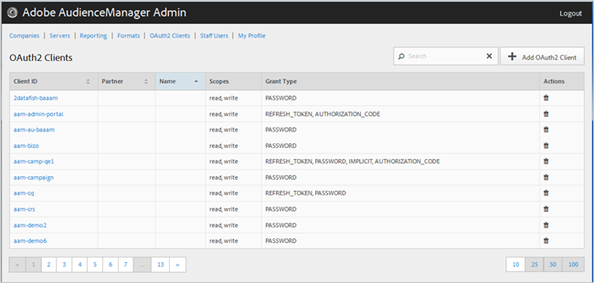

# OAuth2-Clients {#oauth-clients}

Auf der Seite [!UICONTROL OAuth2 Clients] können Sie eine Liste der [!UICONTROL OAuth2] Clients in Ihrer [!DNL Audience Manager]-Konfiguration anzeigen. Sie können bestehende Clients bearbeiten oder löschen oder neue Clients erstellen, sofern Sie über die entsprechenden Benutzerrollen verfügen.

## Überblick {#overview}

<!-- c_oauth.xml -->

>[!NOTE]
>
>Stellen Sie sicher, dass Ihr Kunde die [OAuth2](https://experienceleague.adobe.com/docs/audience-manager/user-guide/api-and-sdk-code/rest-apis/aam-api-getting-started.html?lang=de#oauth)-Dokumentation im Audience Manager-Benutzerhandbuch liest.

[!DNL OAuth2] ist ein offener Autorisierungsstandard, um einen gesicherten delegierten Zugriff auf [!DNL Audience Manager] Ressourcen im Namen eines Ressourceneigentümers bereitzustellen.

Sie können jede Spalte in auf- oder absteigender Reihenfolge sortieren, indem Sie auf die Kopfzeile der gewünschten Spalte klicken.

Verwenden Sie das [!UICONTROL Search] oder die Steuerelemente für die Paginierung unten in der Liste, um den gewünschten Client zu finden.

## Erstellen oder Bearbeiten eines OAuth2-Clients {#create-edit-client}

<!-- t_create_edit_auth.xml -->

Verwenden Sie die Seite [!UICONTROL OAuth2 Clients] im Audience Manager [!UICONTROL Admin]-Tool, um einen neuen [!UICONTROL Oauth2]-Client zu erstellen oder einen vorhandenen Client zu bearbeiten.

1. Um einen neuen [!UICONTROL OAuth2]-Client zu erstellen, klicken Sie auf **[!UICONTROL OAuth2 Clients]** > **[!UICONTROL Add OAuth2 Client]**. Um einen vorhandenen [!UICONTROL OAuth2]-Client zu bearbeiten, klicken Sie in der Spalte **[!UICONTROL Client ID]** auf den gewünschten Client.
1. Geben Sie den gewünschten Namen für diesen [!UICONTROL OAuth2]-Client an. Beachten Sie, dass es sich hierbei nur um einen Namen für den Datensatz handelt.
1. Geben Sie die E-Mail-Adresse des [!UICONTROL OAuth2]-Clients an. Es gibt ein Limit von einer E-Mail-Adresse.
1. Wählen Sie aus der Dropdown-Liste **[!UICONTROL Partner]** den gewünschten Partner aus.
1. Geben Sie im **[!UICONTROL Client ID]** die gewünschte ID an. Dies ist der Wert, der beim Senden von [!DNL API] verwendet wird. Das Präfix wird automatisch ausgefüllt, wenn Sie mit der Eingabe beginnen, nachdem Sie einen [!UICONTROL Partner] aus der Dropdown-Liste im vorherigen Schritt ausgewählt haben. Das richtige Format ist &lt; *`partner subdomain`*> - &lt; *`Audience Manager username`*>.
1. Aktivieren oder deaktivieren Sie bei Bedarf das Kontrollkästchen **[!UICONTROL Restrict to Partner Users]** . Wenn dieses Kontrollkästchen aktiviert ist, muss der Benutzer ein [!DNL Audience Manager] Benutzer sein, der für den ausgewählten Partner aufgeführt ist. Als Best Practice empfehlen wir, diese Option auszuwählen.
1. Aktivieren oder deaktivieren Sie im Abschnitt **[!UICONTROL Scope]** die Kontrollkästchen **[!UICONTROL Read]** und **[!UICONTROL Write]** nach Bedarf.
1. Wählen Sie im Abschnitt **[!UICONTROL Grant Type]** die gewünschten Autorisierungsmöglichkeiten aus. Es wird empfohlen, die Standardeinstellungen der Optionen [!UICONTROL Password] und [!UICONTROL Refresh-token] zu verwenden.

   * **[!UICONTROL Implicit]**: Wenn Sie diese Option auswählen, wird das [!UICONTROL Redirect URI] aktiviert. Der Benutzer erhält nach der Authentifizierung ein automatisches Zugriffs-Token und wird sofort an die Umleitungs-[!DNL URI] gesendet.
   * **[!UICONTROL Authorization Code]**: Wenn Sie diese Option auswählen, wird das [!UICONTROL Redirect URI] aktiviert. Der Benutzer wird nach der Authentifizierung an den Client zurückgegeben und dann an den [!DNL URI] gesendet.
   * **[!UICONTROL Password]**: Der Benutzer wird mit einem vom Benutzer eingegebenen Kennwort anstatt mit einem automatischen Validierungsversuch über einen Autorisierungs-Server authentifiziert.
   * **[!UICONTROL Refresh_token]**: Wird verwendet, um ein abgelaufenes Zugriffstoken für einen längeren Zeitraum zu aktualisieren.

1. Geben Sie im **[!UICONTROL Redirect URI]** die gewünschte [!DNL URI] an. Diese Option ist nur aktiviert, wenn Sie die Gewährungstypen **[!UICONTROL Implicit]** und **[!UICONTROL Authorization_code]** auswählen. Im **[!UICONTROL Redirect URI]** können Sie einen kommagetrennten Wert mit zulässigen [!DNL URI] angeben. Dies ist der [!DNL URI], zu dem ein Benutzer eines Clients weitergeleitet wird, nachdem er den Client für den [!DNL API] Zugriff genehmigt hat.
1. Geben Sie die gewünschte Ablaufzeit (in Sekunden) für das Ablaufdatum des Zugriffs- und Aktualisierungstokens an.

   * **[!UICONTROL Access Token Expiration Time]**: Die Anzahl der Sekunden, die ein Zugriffstoken nach seiner Ausgabe gültig ist. Kann null sein, um den Plattformstandard zu verwenden (12 Stunden). Kann auch -1 sein, um anzugeben, dass das Zugriffstoken nicht abläuft.
   * **[!UICONTROL Refresh Token Expiration Time]**: Die Anzahl der Sekunden, die ein Aktualisierungs-Token nach der Ausgabe gültig ist. Kann null sein, um den Plattformstandard zu verwenden (30 Tage).

1. Klicken Sie auf **[!UICONTROL Save]**.

Um einen [!UICONTROL OAuth2] Client zu löschen, klicken Sie auf **[!UICONTROL OAuth2 Clients]** und anschließend auf  in der Spalte **[!UICONTROL Actions]** für den gewünschten Client.

>[!MORELIKETHIS]
>
>* [API-Anforderungen und -Empfehlungen](../admin-oauth2/aam-admin-api-requirements.md)
