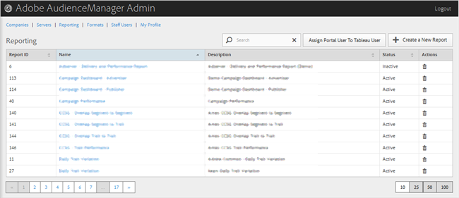

# Berichterstellung {#reporting}

Verwalten von Audience Manager-Berichten durch Erstellen neuer Berichte oder Bearbeiten oder Löschen vorhandener Berichte. Sie können auch einen Portalbenutzer als [!DNL Tableau] Benutzer zuweisen.

<!-- c_reporting.xml -->

Sie können jede Spalte in auf- oder absteigender Reihenfolge sortieren, indem Sie auf die Kopfzeile der gewünschten Spalte klicken.

Verwenden Sie das [!UICONTROL Search] oder die Steuerelemente für die Paginierung unten in der Liste, um den gewünschten Bericht zu finden.
