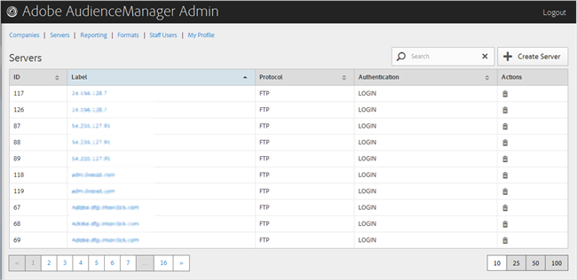

# Löschen eines Servers {#delete-a-server}

Verwenden Sie die Seite &quot;[!UICONTROL Servers]&quot;im Audience Manager-Admin-Tool, um einen vorhandenen Server zu löschen.

<!-- t_delete_server.xml -->

>[!NOTE]
>
>Sie müssen über die Rolle &quot;[!UICONTROL DEXADMIN]&quot;verfügen, um vorhandene Server zu löschen.

1. Um einen vorhandenen Server zu löschen, klicken Sie auf **[!UICONTROL Servers]**.

   

1. Klicken Sie in der Spalte **[!UICONTROL Actions]** des gewünschten Servers auf .
1. Klicken Sie auf **[!UICONTROL OK]** , um den Löschvorgang zu bestätigen.
