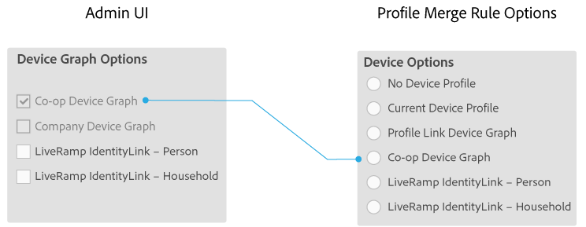
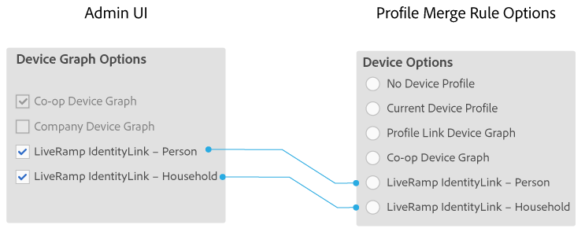

# Gerätediagrammoptionen für Unternehmen {#device-graph-options-for-companies}

Die [!UICONTROL Device Graph Options] sind für Unternehmen verfügbar, die am [!DNL Adobe Experience Cloud Device Co-op] teilnehmen. Wenn ein Kunde auch eine Vertragsbeziehung mit einem Gerätediagramm-Drittanbieter unterhält, der in Audience Manager integriert ist, werden in diesem Abschnitt Optionen für dieses Gerätediagramm angezeigt. Diese Optionen befinden sich unter [!UICONTROL Companies] > Firmenname > [!UICONTROL Profile] > [!UICONTROL Device Graph Options].

In dieser Abbildung werden allgemeine Namen für die Gerätediagrammoptionen von Drittanbietern verwendet. In der Produktion stammen diese Namen vom Gerätediagramm-Provider und können von dem hier gezeigten variieren. Beispielsweise sind die [!DNL LiveRamp] -Optionen in der Regel (aber nicht immer):

* Beginnen Sie mit &quot;[!DNL LiveRamp]&quot;
* Enthält einen Vornamen, der variiert
* Mit &quot;[!UICONTROL - Household]&quot; oder &quot;[!UICONTROL -Person]&quot; enden

## Definierte Gerätediagrammoptionen {#device-graph-options-defined}

Die hier ausgewählten Gerätediagrammoptionen zeigen die [!UICONTROL Device Options]-Optionen an, die einem [!DNL Audience Manager] -Kunden zur Verfügung stehen, wenn er eine [!UICONTROL Profile Merge Rule] erstellt.

### Co-op-Gerätediagramm {#co-op-graph}

Kunden, die an der [Adobe Experience Cloud-Gerätekooperation](https://experienceleague.adobe.com/docs/device-co-op/using/about/overview.html?lang=en) teilnehmen, verwenden diese Optionen, um eine [!UICONTROL Profile Merge Rule] mit [deterministischen und probabilistischen Daten](https://experienceleague.adobe.com/docs/device-co-op/using/device-graph/links.html?lang=en) zu erstellen. Der [!DNL Corporate Provisioning Team] aktiviert und deaktiviert diese Option über einen Back-End-Aufruf vom Typ [!DNL API]. Sie können diese Felder im [!DNL Admin UI] nicht aktivieren oder löschen. Außerdem schließen sich die Optionen **[!UICONTROL Co-op Device Graph]** und **[!UICONTROL Company Device Graph]** gegenseitig aus. Kunden können uns bitten, das eine oder das andere zu aktivieren, aber nicht beides. Wenn diese Option aktiviert ist, wird das Steuerelement **[!UICONTROL Co-op Device Graph]** in den Einstellungen für [!UICONTROL Device Options] für eine [!UICONTROL Profile Merge Rule] verfügbar gemacht.

### Gerätediagramm für Unternehmen {#company-graph}

Diese Option richtet sich an [!DNL Analytics] -Kunden, die die Metrik [!UICONTROL People] in ihrer [!DNL Analytics] Report Suite verwenden. Der [!DNL Corporate Provisioning Team] aktiviert und deaktiviert diese Option über einen Back-End-Aufruf vom Typ [!DNL API]. Sie können diese Felder im [!DNL Admin UI] nicht aktivieren oder löschen. Außerdem schließen sich die Optionen **[!UICONTROL Company Device Graph]** und **[!UICONTROL Co-op Device Graph]** gegenseitig aus. Kunden können uns bitten, das eine oder das andere zu aktivieren, aber nicht beides. Wenn aktiviert:

* Dieses Gerätediagramm verwendet deterministische Daten, die zu dem Unternehmen gehören, das Sie konfigurieren (keine probabilistischen Daten).
* [!DNL Audience Manager] erstellt automatisch einen [!UICONTROL Data Source] namens `*`Partnernamen`*-Company Device Graph-Person`. Auf der Detailseite [!UICONTROL Data Source] können [!DNL Audience Manager] -Kunden den Partnernamen und die Beschreibung ändern und [Datenexportkontrollen](https://experienceleague.adobe.com/docs/device-co-op/using/device-graph/links.html?lang=en) auf diese Datenquelle anwenden.
* [!DNL Audience Manager] Kunden *sehen keine* neue Einstellung im Abschnitt [!UICONTROL Device Options] für einen [!UICONTROL Profile Merge Rule].

### LiveRamp-Gerätediagramm (Person oder Haushalt) {#liveramp-device-graph}

Diese Kontrollkästchen sind in der [!DNL Admin UI] aktiviert, wenn ein Partner eine [!UICONTROL Data Source] erstellt und **[!UICONTROL Use as an Authenticated Profile]** und/oder **[!UICONTROL Use as a Device Graph]** auswählt. Die Namen für diese Einstellungen werden vom Gerätediagramm-Anbieter eines Drittanbieters (z. B. [!DNL LiveRamp], [!DNL TapAd] usw.) bestimmt. Wenn diese Option aktiviert ist, bedeutet dies, dass das Unternehmen, das Sie konfigurieren, die von diesen Gerätediagrammen bereitgestellten Daten verwenden wird.

>[!MORELIKETHIS]
>
>* [Für Profilzusammenführungsrichtlinien definierte Optionen](https://experienceleague.adobe.com/docs/audience-manager/user-guide/features/profile-merge-rules/merge-rule-definitions.html?lang=en)
>* [Source-Einstellungen und Menüoptionen für Daten](https://experienceleague.adobe.com/docs/audience-manager/user-guide/features/data-sources/datasources-list-and-settings.html?lang=en)
