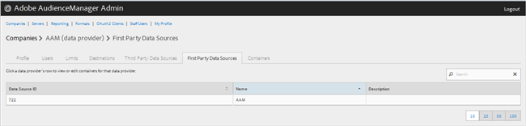
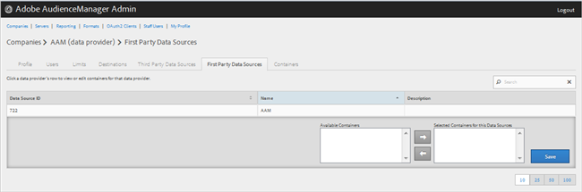

# Verwalten von Erstanbieter-Datenanbietern {#manage-first-party-data-providers}

Anzeigen oder Bearbeiten von Containern und Zuordnungen für Erstanbieter von Daten.

<!-- t_first_party_providers.xml -->

1. Klicken Sie auf &quot;**[!UICONTROL Companies]**&quot;, suchen Sie das gewünschte Unternehmen und klicken Sie darauf, um dessen Seite &quot;[!UICONTROL Profile]&quot;anzuzeigen. Verwenden Sie das Feld [!UICONTROL Search] oder die Paginierungssteuerelemente am unteren Rand der Liste, um das gewünschte Unternehmen zu finden. Sie können jede Spalte in auf- oder absteigender Reihenfolge sortieren, indem Sie auf die Kopfzeile der gewünschten Spalte klicken.

1. Klicken Sie auf die Registerkarte **[!UICONTROL First Party Data Providers]** .

   

1. Klicken Sie auf die Zeile eines Datenanbieters, um Container und Zuordnungen für diesen Datenanbieter anzuzeigen oder zu bearbeiten.

   

1. Verschieben Sie Behälter aus den Listen **[!UICONTROL Available Containers]** und **[!UICONTROL Selected Containers for This Data Provider]**, indem Sie die gewünschten Container auswählen und dann nach Bedarf auf die Rechts- oder Linkspfeile klicken.
1. Klicken Sie auf **[!UICONTROL Save]** , wenn Sie Änderungen vorgenommen haben.
