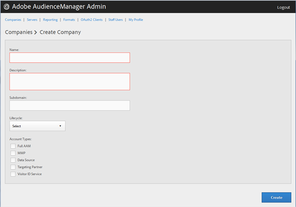
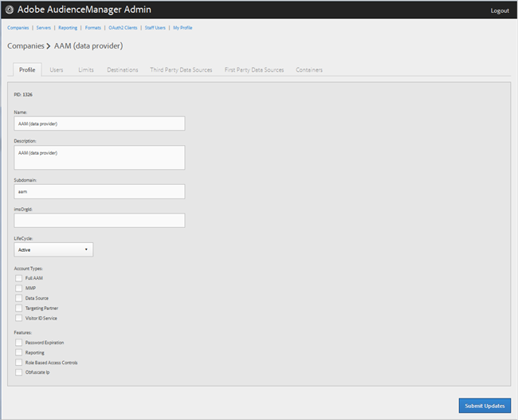
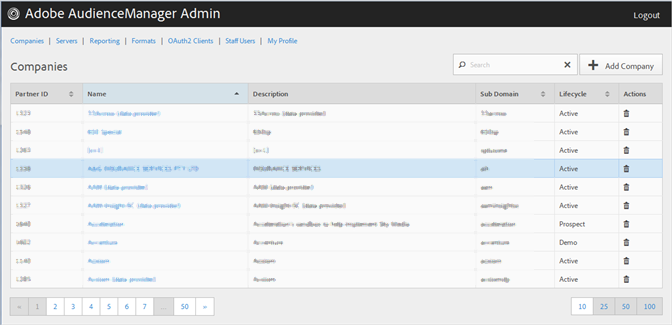

# Erstellen eines Unternehmensprofils {#create-a-company-profile}

Auf der Seite [!UICONTROL Companies] im Audience Manager Admin-Tool können Sie eine neue Firma erstellen.

<!-- t_create_company.xml -->

>[!NOTE]
>
>Sie müssen über die **[!UICONTROL DEXADMIN]** Rolle verfügen, um neue Unternehmen zu gründen.

1. Klicken Sie auf **[!UICONTROL Companies]** > **[!UICONTROL Add Company]**.
1. Füllen Sie die Felder aus:

   * **[!UICONTROL Name]**: (Erforderlich) Geben Sie den Namen des Unternehmens an.
   * **[!UICONTROL Description]**: (Erforderlich) Geben Sie beschreibende Informationen über das Unternehmen an, z. B. die Branche oder seinen vollständigen Namen.
   * **[!UICONTROL Subdomain]**: (Erforderlich) Geben Sie die Subdomain des Unternehmens an. Der eingegebene Text wird als Subdomain des Ereignisaufrufs angezeigt. Dies kann nicht geändert werden. Es muss sich um eine Zeichenfolge mit [!DNL URL] Zeichen handeln.

     Wenn Ihr Unternehmen beispielsweise [!DNL AcmeCorp] heißt, wird die Subdomain [!DNL acmecorp].

     Audience Manager verwendet die Subdomain für die [!UICONTROL Data Collection Server] (DCS). Im vorherigen Beispiel wäre die vollständige [!DNL URL] Ihres Unternehmens in [!UICONTROL DCS] [!DNL acmecorp.demdex.net].

   * **[!UICONTROL Lifecyle]**: Geben Sie den gewünschten Schritt für das Unternehmen an:
      * **[!UICONTROL Active]**: Geben Sie an, dass das Unternehmen ein aktiver Audience Manager-Client sein soll. Ein [!UICONTROL Active]-Konto bedeutet einen zahlenden Kunden, nicht nur für die Beratung, sondern auch für die Audience Manager-SKU.
      * **[!UICONTROL Demo]**: Geben Sie an, dass die Firma nur zu Demozwecken verwendet wird. Berichtsdaten werden automatisch gefälscht.
      * **[!UICONTROL Prospect]**: Geben Sie an, dass das Unternehmen ein potenzieller Audience Manager-Kunde ist, z. B. ein Unternehmen, dem eine kostenlose [!DNL POC] oder eine Kontoeinrichtung für eine Verkaufsdemo zugewiesen wird.
      * **[!UICONTROL Test]**: Geben Sie an, dass das Unternehmen nur zu internen Testzwecken verwendet werden soll.

   * **[!UICONTROL Account Types]**: Geben Sie den vollständigen Satz der Kontotypen für diese Firma an. Kein Kontotyp schließt sich mit einem anderen Typ gegenseitig aus.
      * **[!UICONTROL Full AAM]**: Geben Sie an, dass das Unternehmen über ein vollständiges Adobe Audience Manager-Konto verfügt und die Benutzer Anmeldezugriff haben.
      * **[!UICONTROL MMP]**: Geben Sie an, dass das Unternehmen für die Verwendung der [!UICONTROL Master Marketing Profile] ([!UICONTROL MMP])-Funktionen aktiviert wurde. Die [!UICONTROL MMP] ermöglicht die Freigabe von Zielgruppen in der Experience Cloud mithilfe eines [!UICONTROL Experience Cloud ID] ([!DNL MCID]), der jedem Besucher zugewiesen wird und dann von Audience Manager verwendet wird. Wenn Sie diesen Kontotyp auswählen, wird die [!UICONTROL Experience Cloud ID Service] ebenfalls automatisch ausgewählt.

        Weitere Informationen finden Sie unter [Experience Cloud-Zielgruppen](https://experienceleague.adobe.com/docs/core-services/interface/services/audiences/audience-library.html?lang=en).

   * **[!UICONTROL Data Source]**: Geben Sie an, dass das Unternehmen ein Drittanbieter von Daten in Audience Manager ist.
   * **[!UICONTROL Targeting Partner]**: Geben Sie an, dass das Unternehmen als Zielgruppenbestimmungsplattform für Audience Manager-Kunden fungiert.
   * **[!UICONTROL Visitor ID Service]**: Geben Sie an, dass das Unternehmen für die Verwendung der [!UICONTROL Experience Cloud Visitor ID Service] aktiviert wurde.

     Die [!UICONTROL Experience Cloud Visitor ID Service] bietet eine universelle Besucher-ID für alle Experience Cloud-Lösungen. Weitere Informationen finden Sie im Benutzerhandbuch zum Experience Cloud-Besucher-ID-Service .

   * **[!UICONTROL Agency]**: Geben Sie an, dass die Firma über ein [!UICONTROL Agency] Konto verfügen soll.

1. Klicken Sie auf **[!UICONTROL Create]**. Fahren Sie mit den Anweisungen in [Bearbeiten eines Firmenprofils](../companies/admin-manage-company-profiles.md#edit-company-profile) fort.

   

## Bearbeiten eines Unternehmensprofils {#edit-company-profile}

Das Profil eines Unternehmens bearbeiten, einschließlich Name, Beschreibung, Subdomain, Lebenszyklus und mehr.

<!-- t_edit_company_profile.xml -->

1. Klicken Sie auf **[!UICONTROL Companies]**, suchen Sie dann das gewünschte Unternehmen und klicken Sie darauf, um dessen [!UICONTROL Profile] anzuzeigen.

   Verwenden Sie das [!UICONTROL Search] oder die Steuerelemente für die Paginierung unten in der Liste, um das gewünschte Unternehmen zu finden. Sie können jede Spalte in auf- oder absteigender Reihenfolge sortieren, indem Sie auf die Kopfzeile der gewünschten Spalte klicken.

   

1. Bearbeiten Sie die Felder nach Bedarf:

   * **[!UICONTROL Name]**: Bearbeiten Sie den Namen des Unternehmens. Dies ist ein Pflichtfeld.
   * **[!UICONTROL Description]**: Bearbeiten Sie die Beschreibung des Unternehmens. Dies ist ein Pflichtfeld.
   * **[!UICONTROL Subdomain]**: (Erforderlich) Geben Sie die Subdomain des Unternehmens an. Der eingegebene Text wird als Subdomain des Ereignisaufrufs angezeigt. Dies kann nicht geändert werden. Es muss sich um eine Zeichenfolge mit [!DNL URL] Zeichen handeln.

     Wenn Ihr Unternehmen beispielsweise [!DNL AcmeCorp] heißt, wird die Subdomain [!DNL acmecorp].

     Audience Manager verwendet die Subdomain für die [!UICONTROL Data Collection Server] (DCS). Im vorherigen Beispiel wäre die vollständige [!DNL URL] Ihres Unternehmens in [!UICONTROL DCS] [!DNL acmecorp.demdex.net].

   * **[!UICONTROL imsOrgld]**: ([!UICONTROL Identity Management System Organization ID]) Mit dieser ID können Sie Ihr Unternehmen mit der Adobe Experience Cloud verbinden.
   * **[!UICONTROL Lifecyle]**: Geben Sie den gewünschten Schritt für das Unternehmen an:
      * **[!UICONTROL Active]**: Geben Sie an, dass das Unternehmen ein aktiver Audience Manager-Client sein soll. Ein Active Account bedeutet einen zahlenden Kunden, nicht nur für die Beratung, sondern auch für die Audience Manager SKU.
      * **[!UICONTROL Demo]**: Geben Sie an, dass die Firma nur zu Demozwecken verwendet wird. Berichtsdaten werden automatisch gefälscht.
      * **[!UICONTROL Prospect]**: Geben Sie an, dass das Unternehmen ein potenzieller Audience Manager-Kunde ist, z. B. ein Unternehmen, dem eine kostenlose [!DNL POC] oder eine Kontoeinrichtung für eine Verkaufsdemo zugewiesen wird.
      * **[!UICONTROL Test]**: Geben Sie an, dass das Unternehmen nur zu internen Testzwecken verwendet werden soll.
   * **[!UICONTROL Account Types]**: Geben Sie den vollständigen Satz der Kontotypen für diese Firma an. Kein Kontotyp schließt sich mit einem anderen Typ gegenseitig aus.
      * **[!UICONTROL Full AAM]**: Geben Sie an, dass das Unternehmen über ein vollständiges Adobe Audience Manager-Konto verfügt und die Benutzer Anmeldezugriff haben.
      * **[!UICONTROL MMP]**: Geben Sie an, dass das Unternehmen für die Verwendung der Funktionen des primären Marketing-Profils ([!UICONTROL MMP]) aktiviert wurde.

        Wenn Sie diesen Kontotyp auswählen, wird auch **[!UICONTROL Visitor ID Service]** automatisch ausgewählt.
Weitere Informationen finden Sie unter [Experience Cloud-Zielgruppen](https://experienceleague.adobe.com/docs/core-services/interface/services/audiences/audience-library.html?lang=en).

   * **[!UICONTROL Data Source]**: Geben Sie an, dass das Unternehmen ein Drittanbieter von Daten in Audience Manager ist.
   * **[!UICONTROL Targeting Partner]**: Geben Sie an, dass das Unternehmen als Zielgruppenbestimmungsplattform für Audience Manager-Kunden fungiert.
   * **[!UICONTROL Visitor ID Service]**: Geben Sie an, dass das Unternehmen für die Verwendung des Experience Cloud-Besucher-ID-Service aktiviert wurde.

     Der Experience Cloud-Besucher-ID-Dienst stellt eine universale Besucher-ID für alle Experience Cloud-Lösungen bereit. Weitere Informationen finden Sie im Benutzerhandbuch zum [Experience Cloud ID-Service](https://experienceleague.adobe.com/docs/id-service/using/home.html?lang=en).

   * **[!UICONTROL Agency]**: Geben Sie an, dass die Firma über ein Agenturkonto verfügen soll.
   * **[!UICONTROL Features]**: Die gewünschten Optionen auswählen:
      * **[!UICONTROL Password Expiration]**: Legt fest, dass alle Benutzerkennwörter in diesem Unternehmen nach 90 Tagen ablaufen, um die Sicherheit in Audience Manager zu erhöhen.
      * **[!UICONTROL Reporting]**: Aktiviert das Audience Manager-Reporting für dieses Unternehmen.
      * **[!UICONTROL Role Based Access Controls]**: Aktivieren Sie rollenbasierte Zugriffssteuerungen für diese Firma. Mit der rollenbasierten Zugriffssteuerung können Sie Benutzergruppen mit unterschiedlichen Zugriffsberechtigungen erstellen. Einzelne Benutzende in diesen Gruppen können dann nur auf bestimmte Funktionen in Audience Manager zugreifen.

1. Klicken Sie auf **[!UICONTROL Submit Updates]**.

## Löschen eines Unternehmensprofils {#delete-company-profile}

Verwenden Sie die Seite [!UICONTROL Companies] im Audience Manager-[!UICONTROL Admin]-Tool, um ein bestehendes Unternehmen zu löschen.

<!-- t_delete_company.xml -->

>[!NOTE]
>
>Sie müssen über die Rolle [!UICONTROL DEXADMIN] verfügen, um vorhandene Unternehmen löschen zu können.

1. Um ein vorhandenes Unternehmen zu löschen, klicken Sie auf **[!UICONTROL Companies]**.

   

1. Klicken Sie in der Spalte **[!UICONTROL Actions]** des gewünschten Unternehmens auf  .
1. Klicken Sie auf **[!UICONTROL OK]** , um den Löschvorgang zu bestätigen.
