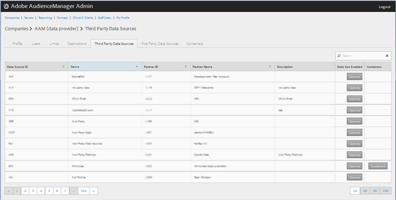

# Verwalten von Datenanbietern von Drittanbietern {#manage-third-party-data-providers}

Anzeigen oder Bearbeiten von Containern und Zuordnungen für Drittanbieter von Daten. Sie können auch die Freigabe für verschiedene Datenanbieter aktivieren.

1. Klicken Sie auf &quot;**[!UICONTROL Companies]**&quot;, suchen Sie das gewünschte Unternehmen und klicken Sie darauf, um dessen Seite &quot;[!UICONTROL Profile]&quot;anzuzeigen.

   Verwenden Sie das Feld [!UICONTROL Search] oder die Paginierungssteuerelemente am unteren Rand der Liste, um das gewünschte Unternehmen zu finden. Sie können jede Spalte in auf- oder absteigender Reihenfolge sortieren, indem Sie auf die Kopfzeile der gewünschten Spalte klicken.
1. Klicken Sie auf die Registerkarte **[!UICONTROL Third Party Data Providers]** .

   

1. Klicken Sie auf die Zeile eines Datenanbieters, um Container und Zuordnungen für diesen Datenanbieter anzuzeigen oder zu bearbeiten.

   

1. Wählen Sie **[!UICONTROL Enable Sharing]** aus, um die folgenden Optionen zu aktivieren:

   * **Überlagerung auf Partnerebene:**
   * **Modellnutzung aktiviert:** Ermöglicht diesem Unternehmen die Verwendung dieses Datenanbieters beim Erstellen algorithmischer Modelle.

   Wenn Sie die Freigabe aktivieren, erhalten Sie von diesem Datenanbieter Zugriff auf Eigenschaften.

1. (Bedingt) Wenn der Container für diesen Anbieter aktiviert ist, können Sie Behälter für diesen Datenanbieter auswählen, indem Sie die gewünschten Container aus der verfügbaren Liste in die ausgewählte Liste verschieben.

   Sie können diese Aufgabe auch über die Seite [Container](../companies/admin-manage-containers.md#task_61DB5CEECC5049DD8D059C642AC3F967) ausführen.
1. Klicken Sie auf **[!UICONTROL Save]** , wenn Sie Änderungen vorgenommen haben.
