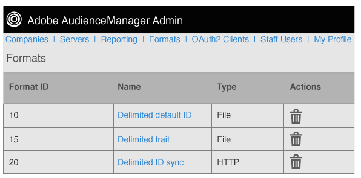

# Formatübersicht {#formats-overview}

Ein Format ist eine gespeicherte Vorlage (oder Datei), die Makros verwendet, um den Inhalt von Daten zu organisieren, die an ein Ziel gesendet werden. Formattypen umfassen [!DNL HTTP] und Dateiformate. [!DNL HTTP] senden Daten in einem [!DNL JSON]-Objekt mit einer [!DNL POST] oder [!DNL GET]. Dateiformate senden Daten in einer Datei per [!DNL FTP]. Mit den von den einzelnen Formaten verwendeten Makros können Sie Dateinamen festlegen, Dateikopfzeilen definieren und den Inhalt einer Datendatei organisieren. In der Admin [!DNL UI] können Sie beim Einrichten von Zielen für Kundinnen und Kunden Formate erstellen, speichern und wiederverwenden.

